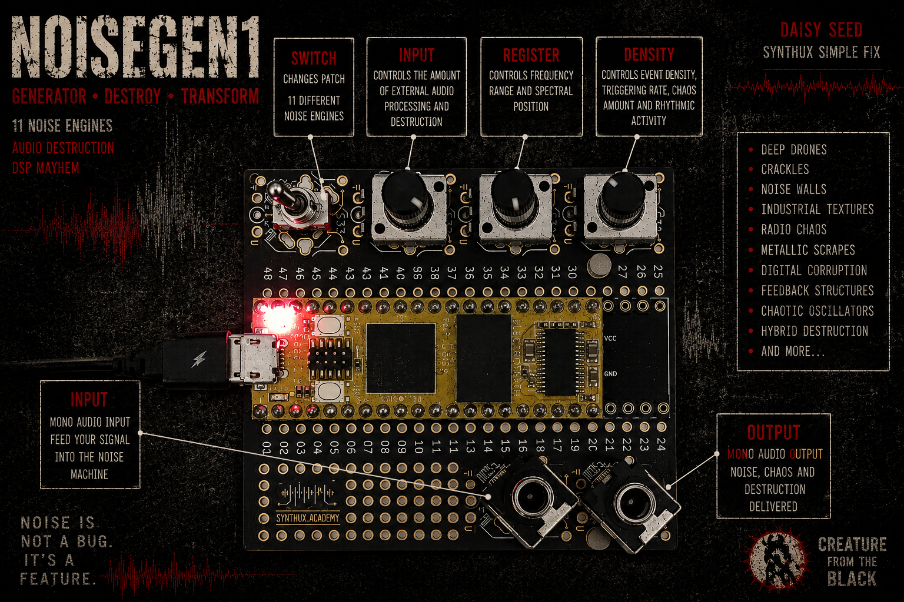

A generative noise synthesizer with an audio-input mangler for the
[Electro-Smith Daisy Seed](https://electro-smith.com/products/daisy-seed) running on the
[Synthux Academy Simple Fix](https://synthux.academy/simple) platform.

A generative noise synthesizer and audio destruction processor for the Electro-Smith Daisy Seed platform.

NoiseGen1 combines 11 unique DSP noise engines into a single instrument. Each engine implements a different synthesis architecture, producing textures ranging from subtle crackles and drones to aggressive harsh noise walls, industrial grinding sounds, radio interference, metallic resonances, and chaotic digital artifacts.

Designed for experimental music, sound design, industrial, noise, ambient, and electroacoustic performance.

## Patches

The toggle switch advances to the next patch on every flip. The on-board LED blinks
N times to confirm patch N.

| # | Patch | Character |
|---|----------|-----------|
| 1 | CLASSICO | Self-evolving cascaded-FM noise core: three sine oscillators in an FM chain with feedback and noise modulation, resonant filtering, ring modulation and a triple wavefolder |
| 2 | ABISSO | Continuous subterranean rumble: a 12–45 Hz sub drone fused with low-passed ground noise, slowly breathing |
| 3 | CREPITIO | Dry electric sparks: random crackle bursts with 1–20 ms tails and true silence in between |
| 4 | MITRAGLIA | A dense noise wall fired in irregular bursts, with sudden ratchet strobes |
| 5 | RADIO | Gritty shortwave scanning: hard-clipped carrier, crushed static surging over the transmission, output decimation |
| 6 | PRESSA | Heavy industrial grinder: a beating pair of low square waves driven into saturation, heaving slowly |
| 7 | LAMIERA | Continuous metal scrape: a slowly gliding inharmonic ring-modulated pair dragged by noise |
| 8 | SOLO-IN | The internal generator is muted: only the destroyed audio input is heard, through an additional extreme mangling stage |
| 9 | MURO | Classic harsh noise wall with life inside: crackling embers and sudden lurches of the low-pass filter |
| 10 | MAGMA | Low-frequency FM boiling with resonant blop pings and a layer of frying noise on the surface |
| 11 | SCULTURA | Cut-up collage: random segments hard-switch between crushed digital garbage, clipped resonant screeches, metallic ring stabs and silence |

## Controls

| Control | Pin | Function |
|---------|-----|----------|
| POT 1 — DENSITY | A0 | Event rate, chaos amount, chop and cut speed |
| POT 2 — REGISTER | A1 | Base frequency range of the active patch |
| POT 3 — INPUT | A2 | Input destruction amount and wet mix |
| SWITCH | D18 | Every flip advances to the next patch |
| LED | on-board | Blinks N times = patch N |

## Audio path

The audio input is gated with hysteresis (it opens on signal and closes on silence, so
an unplugged input stays completely quiet), boosted, then destroyed through overdrive,
wavefolding, bit reduction and sample-rate decimation. The result is recombined with
the generator at two points: injected into the FM cascade, where it deforms the core
itself, and ring-modulated against the top oscillator before the output mix.

A slow RMS leveler keeps the perceived output volume constant across patches and pot
positions. The correction gain is bounded (×0.35 to ×2.5), settles in about half a
second, freezes below a silence threshold so pauses are never pumped up, and each
patch sets its own target level so dynamic patches keep their character. A soft
limiter, DC blocker and a gentle low-pass condition the final output.

| | |
|---|---|
| Input | 3.5 mm mono jack |
| Output | 3.5 mm stereo jack |
| Sample rate | 48 kHz, 24-bit |

## Hardware

Built for the Synthux Academy Simple Fix faceplate with a Daisy Seed:

- three potentiometers on slots S30, S31, S32 (pins A0, A1, A2)
- one toggle switch on slot S33 (pin D18, read with an internal pull-up)
- the built-in 3.5 mm audio input and output jacks

## Building and flashing

1. Install the [Arduino IDE](https://www.arduino.cc/en/software) and the
   [DaisyDuino](https://github.com/electro-smith/DaisyDuino) library
   (Library Manager → search "DaisyDuino").
2. Open `NoiseGen1.ino` and select **Tools → Board → Daisy Seed**.
3. Put the Daisy Seed in bootloader mode: hold **BOOT**, press and release **RESET**,
   then release **BOOT**.
4. Click **Upload**. When the upload completes, press **RESET**.

No external libraries are required beyond DaisyDuino.

## License

MIT
